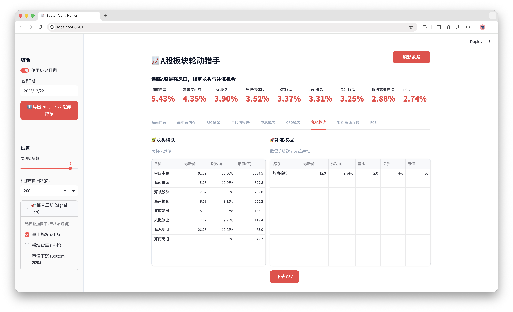

# A股板块轮动猎手

> **免责声明：**
> ⚠️ **股市有风险，投资需谨慎。**
> ⚠️ **本项目仅供学习交流，请勿用于实际交易‼️** 
> 🧪 **Vibe Coding 警告**：本项目是通过 "Vibe Coding" 模式开发的，请在好奇心的驱动下谨慎使用。

**A股板块轮动猎手** 是一款专为短线投资者设计的 A 股市场热点追踪工具。它能实时监控市场中最强板块，并自动挖掘潜在的“补涨”标的。

## Demo


## 核心功能

- **实时板块扫描**: 调用东方财富实时数据，锁定全市场涨幅最高的概念板块。
- **龙头与补涨**: 自动将板块成分股划分为“龙头梯队”（涨停/高标）和“补涨挖掘”（低位活跃股）。
- **信号工坊 (Signal Lab)**: 模块化的量化因子筛选，支持多条件叠加：
    - **量比爆发 (>1.5)**: 捕捉瞬间资金点火异动。
    - **板块背离**: 挖掘板块已大涨、个股仍滞涨的“弹簧”机会。
    - **市值下沉 (Bottom 20%)**: 锁定板块内弹性最高的小市值个股。
- **历史涨停导出**: 支持查询并下载任意历史日期的全市场涨停池，生成清晰的 Excel 友好型 CSV。
- **现代化 UI**: 采用类 Linear/OpenAI 的极简主义设计风格，单页展示，信息密度极高。

## 安装指南

1.  **克隆项目**
2.  **安装依赖**:
    ```bash
    python3 -m venv venv
    source venv/bin/activate
    pip install -r requirements.txt
    ```

## 使用手册

运行 Streamlit 仪表盘:

```bash
streamlit run main.py
```

### 1. 市场监控
- 顶部指标栏实时滚动当前最强板块名。
- 每个板块标签页内，左侧为**龙头梯队**（对标观察），右侧为**补涨挖掘**（操作目标）。

### 2. 信号工坊 (侧边栏)
通过侧边栏的**信号工坊**进行精确筛选：
- **严格“与”逻辑**: 勾选多个信号时，只有同时满足所有条件的个股才会被显示。
- **实时过滤**: 动态调整过滤条件，帮助你在纷杂的盘面中快速收窄目标。

### 3. 历史导出
- 在侧边栏开启“使用历史日期”。
- 选择日期后点击“导出涨停数据”。
- 下载包含代码、名称、价格、连板高度、涨停原因等关键信息的 CSV 文件。

### 参数设置
- **展现板块数 (Top N)**: 设置要扫描的热门板块数量 (1-10)。
- **补补市值上限**: 筛选补涨股时的最大市值阈值 (默认 200亿)。

## 项目结构

- `main.py`: 前端入口 (Streamlit)。
- `logic.py`: 信号引擎与核心策略算法。
- `data_loader.py`: 数据获取层 (AkShare)，支持并行加载与多级缓存。
- `memory-bank/`: 完整的技术文档体系（架构方案、开发进度、信号逻辑）。
