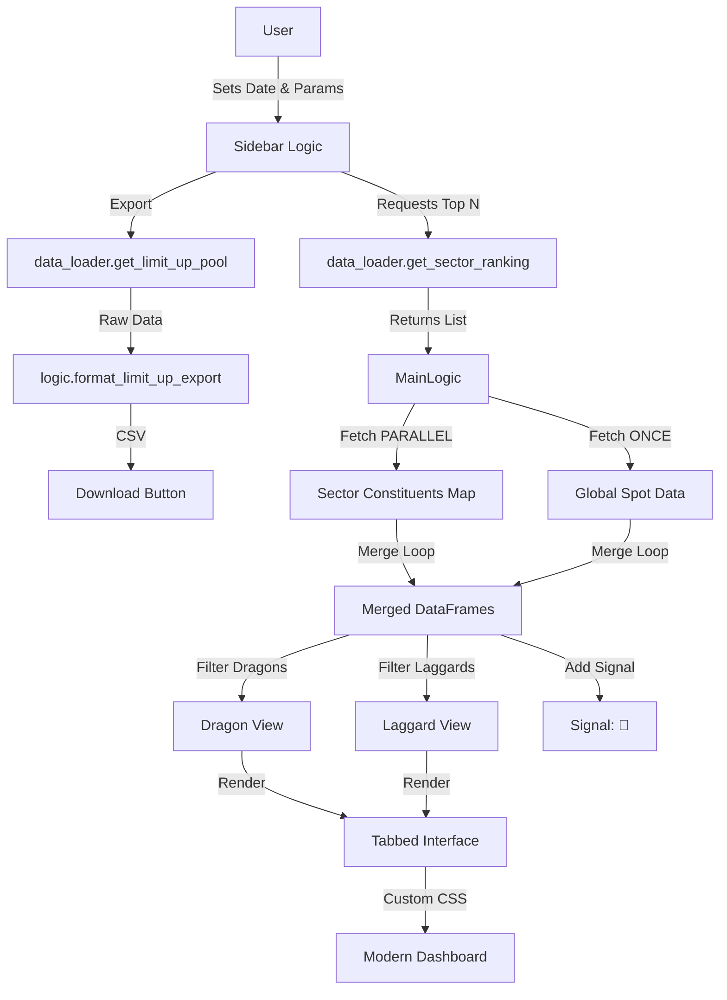

# Architecture Documentation

## System Overview
Sector Alpha Hunter is a stateless, single-page web application built with Streamlit. It relies on real-time data from AkShare (Eastmoney) and processes it in-memory using Pandas.

## Component Roles

### 1. Data Layer (`data_loader.py`)
- **Responsibility**: Fetch raw data and handle API idiosyncrasies.
- **Key Strategy**: **Global Fetch + Parallel Join**.
    - **Step 1**: Fetch Global Spot Data (All A-Shares) ONCE. (`get_all_market_spot_data`)
    - **Step 2**: Fetch Constituents for Top N Sectors in PARALLEL. (`get_multiple_sector_cons`)
    - **Step 3**: Merge in-memory.
- **Performance**: Reduces N sequential massive requests to 1 massive request + N tiny requests.
- **Caching**: Uses `@st.cache_data` with TTL (300s for Ranking, 60s for Global Spot) to balance freshness and performance.
- **Context Injection**: Supports passing "Macro" data (like `sector_gain`) down to the "Micro" level (individual stocks) during the merge phase. This allows the Logic Layer to calculate relative metrics (e.g., `Sector Deviation`) without re-fetching sector info.

### 2. Logic Layer (`logic.py`)
- **Responsibility**: Pure functions for data transformation.
- **Functions**:
    - `clean_data`: **Type Guard**. Enforces `float` types.
    - `filter_dragons`: `Gain >= 9.0%` AND `Name != *ST*`.
    - `filter_laggards`: `0% <= Gain <= 4.0%` AND `MC < Limit` AND `Turnover > 3%`.
    - `add_signals`: `Volume Ratio > 1.5` -> add "🔴".
    - `format_limit_up_export`: Formats raw API data for Excel-friendly CSV export (Renaming, Unit Conversion, Sorting).
- **Signal Engine**:
    - **Registry Pattern**: Signals are registered in `SIGNAL_REGISTRY` dict, decoupling definition from execution.
    - **Composite Logic**: `apply_signals` accepts a list of signal IDs and applies them as a **Strict AND** (Intersection) filter. This allows users to compose custom strategies (e.g., "Small Cap" AND "High Vol").
- **Available Signals (Phase 1)**:
    - `vol_ratio`: `Volume Ratio > 1.5`
    - `sector_divergence`: `Sector Gain - Stock Gain > 3.0`
    - `small_cap`: `Market Cap <= Quantile(0.2)`

### 3. UI Layer (`main.py`)
- **Responsibility**: Rendering and User Interaction.
- **Design Philosophy**: **"Linear-Style" Minimalist**.
    - **Visuals**: Custom CSS injected to enforce Inter font, remove Streamlit's default padding, and apply a clean White/Borders/Red-Accent palette.
    - **Layout**: 
        - **Header**: Compact title bar.
        - **Sidebar**:
            - **Settings**: Top N, Laggard Market Cap Limit.
            - **Signal Lab (New)**: Checkbox menu to toggle quantitative filters (Volume Ratio, Deviation, Small Cap).
            - **Export**: Historical Limit-Up Data Downloader.
        - **Metrics**: Horizontal cards for top sectors.
        - **Main View**: Tabbed interface per sector.
        - **Split View**: Inside each tab, a 2-column layout displays "Dragons" (Left) and "Laggards" (Right) side-by-side to maximize information density.
    - **Unit Conversion**: Market Caps are divided by 100,000,000 to display "Billions (亿)" in the UI, while logic uses raw units.

## File Responsibilities

- **`main.py` (UI Layer)**:
    - **Entry Point**: Defines specific Streamlit page config and layout.
    - **Sidebar**: Manages "Signal Lab" state (User Preferences).
    - **Orchestration**: unique responsibility to fetch data (Loader) -> Process (Logic) -> Render.
- **`logic.py` (Signal Engine)**:
    - **Registry**: Holds the definition of all quantitative signals (`SIGNAL_REGISTRY`).
    - **Processing**: Contains `clean_data` (normalization), `filter_dragons` (rules), and `apply_signals` (engine).
    - **Pure Logic**: No API calls, no UI rendering. Pure Data Transformation.
- **`data_loader.py` (Data Access)**:
    - **Abstraction**: Wraps `AkShare` APIs.
    - **Optimization**: Handles Caching (`st.cache_data`) and Concurrency (`ThreadPoolExecutor`).
    - **Context Injection**: `merge_stock_data` injects Macro data (Sector Gain) into Micro data (Stock Rows).

## Data Flow Diagram

